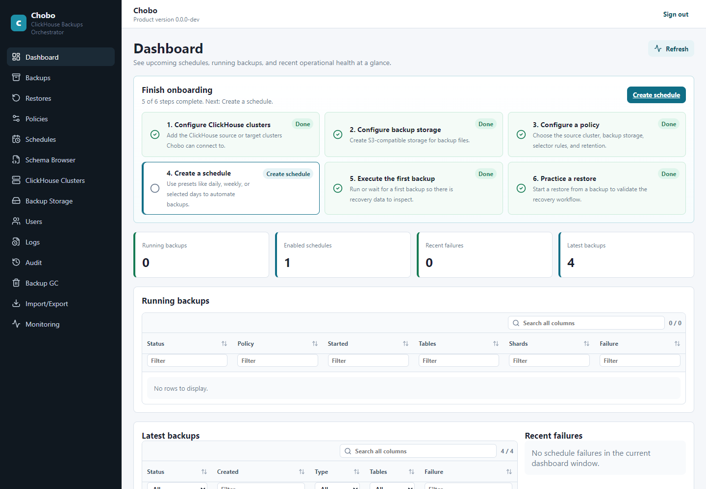
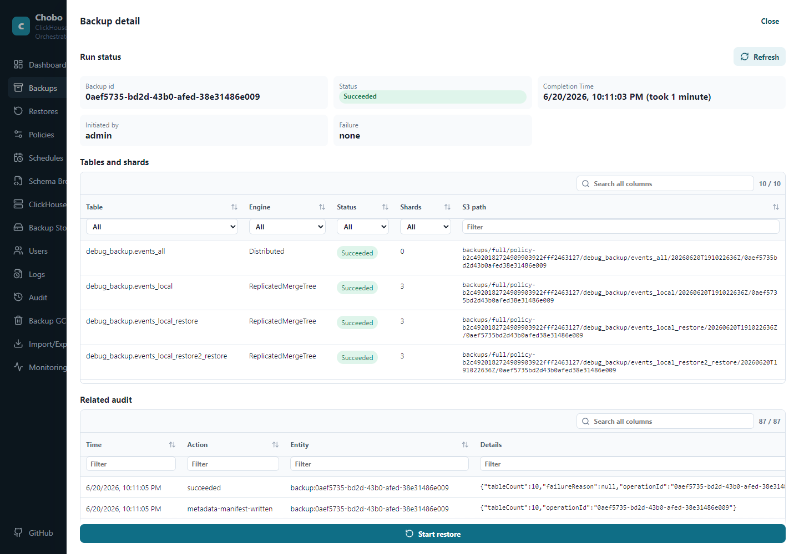
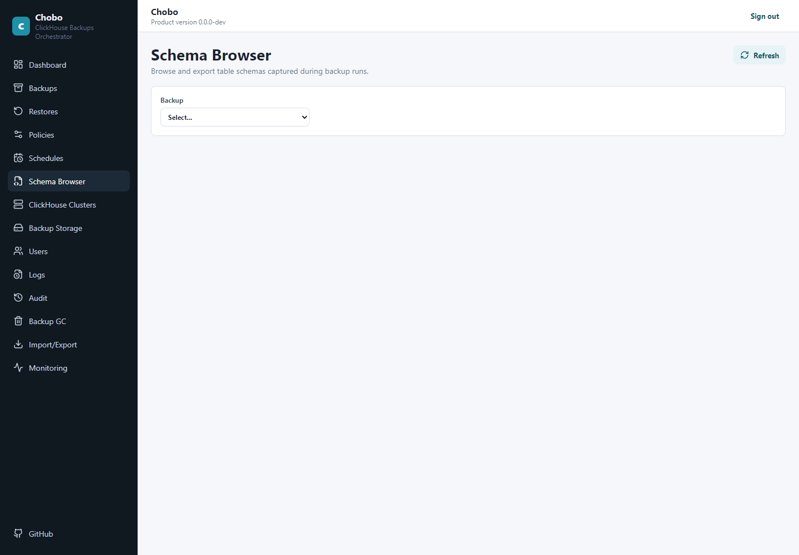
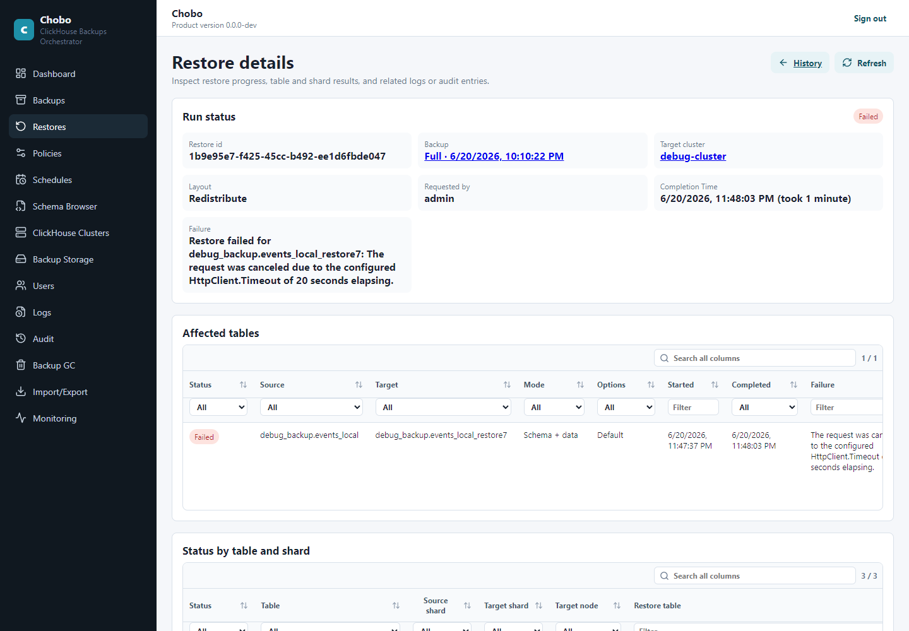

# Chobo - ClickHouse Backups Orchestrator 

Chobo is for DBAs who run ClickHouse clusters and need backups they can schedule, inspect, and restore without building their own orchestration. Add your ClickHouse cluster, add your S3-compatible backup storage, create a backup policy, then run it manually or on a schedule from the web UI or CLI.

## Screenshots









## Start Using Chobo

Pull the Docker images:

```bash
docker pull shahargv/chobo:server-latest
docker pull shahargv/chobo:cli-latest
```

Create a persistent data volume and a stable 32-byte encryption key:

```bash
docker volume create chobo-data
export CHOBO_ENCRYPTION_KEY_BASE64="$(openssl rand -base64 32)"
```

Run ChoboServer on port `8080` with its data directory mounted:

```bash
docker run -d \
  --name chobo-server \
  --restart unless-stopped \
  -p 8080:8080 \
  -v chobo-data:/var/lib/chobo \
  -e ASPNETCORE_URLS=http://0.0.0.0:8080 \
  -e CHOBO_DATA_DIRECTORY=/var/lib/chobo \
  -e CHOBO_ENCRYPTION_KEY_BASE64="$CHOBO_ENCRYPTION_KEY_BASE64" \
  shahargv/chobo:server-latest
```

Open `http://localhost:8080` and complete the first-run setup.

Then follow:

- [Production setup](docs/ProductionSetup.md)
- [Configuration](docs/Configuration.md)
- [Setting up backups](docs/Backups.md)
- [Restoring](docs/Restoring.md)
