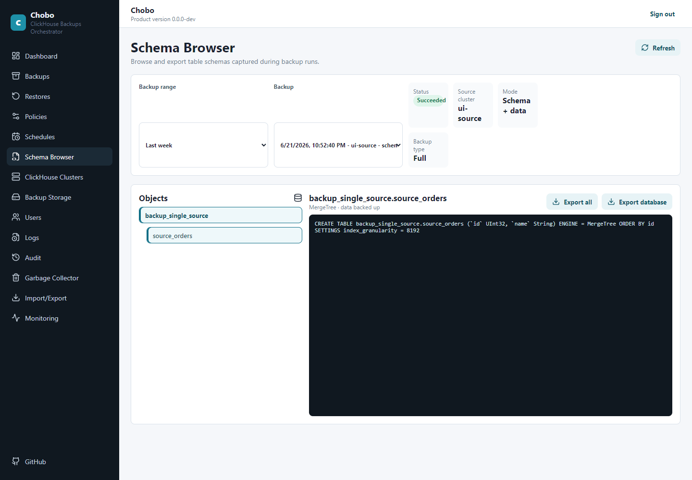

# Chobo - ClickHouse Backup and Restore Orchestrator

Chobo is for DBAs who run ClickHouse clusters and need backups they can schedule, inspect, and restore without building their own orchestration. Add your ClickHouse cluster, add your S3-compatible backup storage, create a backup policy, then run it manually or on a schedule from the web UI or CLI.

## Screenshots





## Trying Chobo locally

```bash
git clone https://github.com/shahargv/Chobo.git
cd Chobo
docker compose -f resources/demo/docker-compose.demo.yml up -d
docker compose -f resources/demo/docker-compose.demo.yml logs -f clickhouse-init demo-init
```

This uses the official Docker Hub images from [resources/demo/docker-compose.demo.yml](resources/demo/docker-compose.demo.yml). The demo starts a sharded and replicated ClickHouse cluster, loads about 200 MB of sample data across two replicated tables, and starts Chobo with the demo storage target and cluster already configured so you can try backup and restore workflows immediately.

| Resource | How to access | Credentials / example |
| --- | --- | --- |
| **Chobo Web GUI** | **http://localhost:18080** | **Access token: `demo-static-access-token`** |
| Chobo CLI | `docker exec chobo-demo-cli dotnet /app/ChoboCli.dll clusters list --server-url http://choboserver:8080 --access-token demo-static-access-token` | Runs inside the Compose network |
| ClickHouse shard 1 replica 1 | HTTP `http://localhost:18111`, native TCP `localhost:19111`, Play `http://localhost:8153/play` | User `default`, empty password |
| ClickHouse shard 1 replica 2 | HTTP `http://localhost:18112`, native TCP `localhost:19112` | User `default`, empty password |
| ClickHouse shard 2 replica 1 | HTTP `http://localhost:18121`, native TCP `localhost:19121` | User `default`, empty password |
| ClickHouse shard 2 replica 2 | HTTP `http://localhost:18122`, native TCP `localhost:19122` | User `default`, empty password |
| MinIO GUI | http://localhost:19001 | User `chobo-access-key`, password `chobo-secret-key` |

When `demo-init` prints `Chobo demo configuration succeeded.`, open the Web GUI. When finished, simply execute `docker compose -f resources/demo/docker-compose.demo.yml down`.

## Start Using Chobo

Pull the Docker images:

```bash
docker pull shahargv/chobo:server-latest
docker pull shahargv/chobo:cli-latest
```

Create a persistent data volume and a stable 32-byte encryption key:

```bash
docker volume create chobo-data
export CHOBO_ENCRYPTION_KEY_BASE64="$(openssl rand -base64 32)"
```

Run ChoboServer on port `8080` with its data directory mounted:

```bash
docker run -d \
  --name chobo-server \
  --restart unless-stopped \
  -p 8080:8080 \
  -v chobo-data:/var/lib/chobo \
  -e ASPNETCORE_URLS=http://0.0.0.0:8080 \
  -e CHOBO_DATA_DIRECTORY=/var/lib/chobo \
  -e CHOBO_ENCRYPTION_KEY_BASE64="$CHOBO_ENCRYPTION_KEY_BASE64" \
  shahargv/chobo:server-latest
```

Open `http://localhost:8080` and complete the first-run setup.

Then follow:

- [Installation](docs/user/Installation.md)
- [Onboarding and initial configuration](docs/user/Onboarding.md)
- [Policies and scheduling](docs/user/PoliciesAndScheduling.md)
- [Backups](docs/user/Backups.md)
- [Restores](docs/user/Restores.md)
- [Security](docs/user/Security.md)

Developer material is kept separately under [developer documentation](docs/developer/README.md).