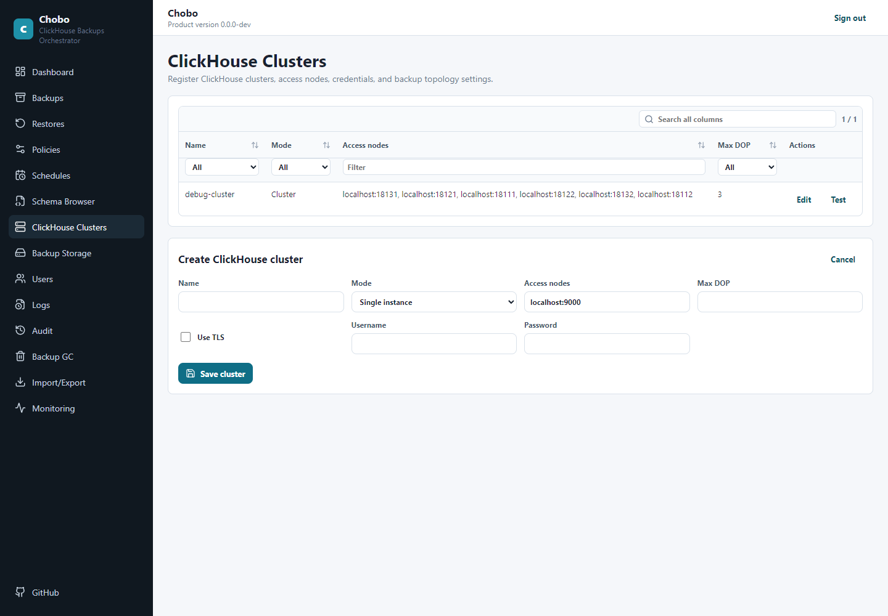
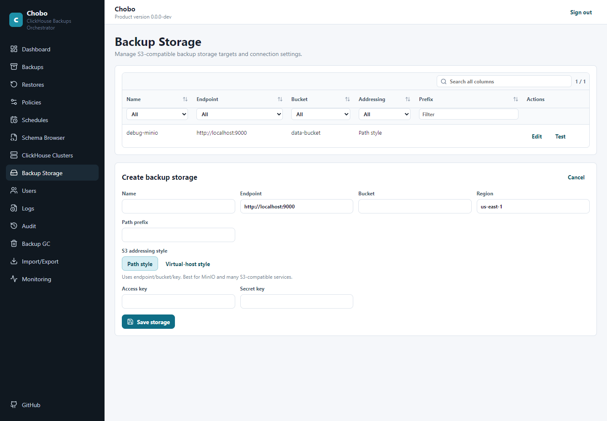
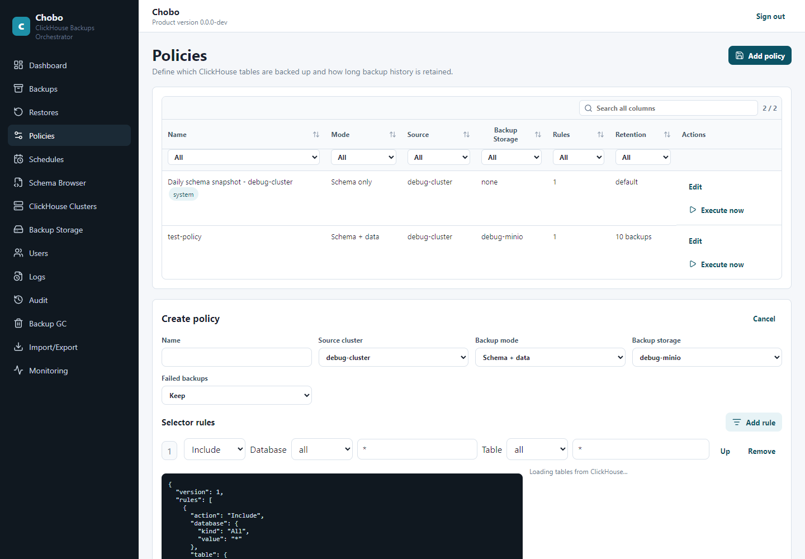

# Production Setup

This guide describes a production-oriented Chobo deployment using the published Docker images. For local development with Docker-hosted ClickHouse and MinIO, see [Local debugging instructions](DebuggingInstructions.MD).

## Deployment Shape

A production deployment has these moving pieces:

- ChoboServer: the HTTP API, web GUI, scheduler, background workers, audit, logs, and SQLite metadata database.
- ChoboCli: the operator CLI, usually run on demand from an admin workstation, automation host, or short-lived container.
- Persistent Chobo data directory: stores `chobo.db`, initialization state, and SQLite-backed operational logs.
- ClickHouse and S3-compatible storage: the systems Chobo backs up from, restores into, and writes backup objects to.

Run ChoboServer close enough to ClickHouse and S3 that it can test connections, submit work, poll status, and clean up expired backup objects. ClickHouse nodes also need their own network path to the S3 endpoint, because ClickHouse performs the actual `BACKUP ... TO S3(...)` and `RESTORE ... FROM S3(...)` operations.

## Ports And Network Access

Expose ChoboServer to operators on port `8080` unless you intentionally choose another port. By default, the web GUI and `/api/v1/*` API are served from the same HTTP listener.

| Direction | Port | Purpose |
| --- | --- | --- |
| Browser or CLI to ChoboServer | `8080/tcp` | Web GUI, API, `/health`, and metrics endpoint. |

Do not publish ClickHouse, S3, or other backend service ports from the ChoboServer container unless your own infrastructure requires it. ChoboServer only needs network access to the ClickHouse HTTP(S) endpoints and S3-compatible storage endpoints that you configure; ClickHouse nodes also need their own network path to the S3 endpoint because ClickHouse performs the actual backup and restore object I/O.

Put ChoboServer behind your normal TLS termination layer for production. Chobo uses bearer-token authentication for the API and GUI, but production traffic should still be protected with TLS.

## Run ChoboServer With Docker

Pull the server image:

```bash
docker pull shahargv/chobo:server-latest
```

Create a stable 32-byte encryption key encoded as Base64 and keep it for the lifetime of the deployment. This key protects stored ClickHouse and S3 credentials; changing it makes existing encrypted credentials unreadable.

Generate a cryptographically random 32-byte key and Base64-encode it:

```bash
openssl rand -base64 32
```

On Windows PowerShell:

```powershell
[Convert]::ToBase64String([System.Security.Cryptography.RandomNumberGenerator]::GetBytes(32))
```

Run the server with a persistent data volume:

```bash
docker volume create chobo-data

docker run -d \
  --name chobo-server \
  --restart unless-stopped \
  -p 8080:8080 \
  --mount type=volume,source=chobo-data,target=/var/lib/chobo \
  -e ASPNETCORE_URLS=http://0.0.0.0:8080 \
  -e CHOBO_DATA_DIRECTORY=/var/lib/chobo \
  -e CHOBO_ENCRYPTION_KEY_BASE64=<base64-32-byte-key> \
  shahargv/chobo:server-latest
```

The `/var/lib/chobo` mount is required for production. It contains the SQLite metadata database, initialization marker, and local operational state. If you provide an external appsettings file, mount that separately and set `CHOBO_APPSETTINGS_PATH`, for example:

```bash
--mount type=bind,source=/etc/chobo,target=/etc/chobo,readonly \
-e CHOBO_APPSETTINGS_PATH=/etc/chobo/appsettings.Production.json
```

## Docker Compose Example

A minimal production-style Compose file for ChoboServer:

```yaml
services:
  chobo-server:
    image: shahargv/chobo:server-latest
    container_name: chobo-server
    restart: unless-stopped
    ports:
      - "8080:8080"
    environment:
      ASPNETCORE_URLS: http://0.0.0.0:8080
      CHOBO_DATA_DIRECTORY: /var/lib/chobo
      CHOBO_ENCRYPTION_KEY_BASE64: ${CHOBO_ENCRYPTION_KEY_BASE64}
    volumes:
      - chobo-data:/var/lib/chobo

volumes:
  chobo-data:
```

Run it with:

```bash
CHOBO_ENCRYPTION_KEY_BASE64=<base64-32-byte-key> docker compose up -d
```

## First Web GUI Setup

Open the GUI at `http://<server-host>:8080`. On a fresh data directory, Chobo starts in initialization mode.


Use the install screen to create the first admin token. Chobo shows that token once; store it in a password manager before leaving the page.

After signing in, the dashboard is the starting point for setup and daily operation.


## Configure ClickHouse Sources

Go to **Clusters** and add the ClickHouse source you want Chobo to protect.



For a single node, enter the ClickHouse host, port, credentials, TLS choice, and backup/restore parallelism. For a ClickHouse cluster, choose cluster mode and provide access nodes plus the ClickHouse cluster name when auto-discovery is not enough.

Chobo uses ClickHouse HTTP(S). If your team normally thinks in native ports, Chobo accepts `9000` and maps it to HTTP `8123`, and accepts TLS `9440` and maps it to HTTPS `8443`. If your deployment exposes custom HTTP(S) ports, enter those ports directly.

## Configure Backup Storage

Go to **Backup Storage** and add an S3-compatible target.



The S3 endpoint must be reachable from the ClickHouse nodes, not only from ChoboServer. Use path-style access when required by MinIO or another S3-compatible provider. Access keys and secret keys are write-only after save.

## Create Policies And Schedules

Go to **Policies** and create a backup policy that connects a ClickHouse source, backup target, table selector, backup mode, and retention settings.



Use include and exclude rules to describe the tables a DBA wants protected. Schema-only policies are useful when the goal is DDL history rather than data backup.

Then go to **Schedules** and create recurring backup work for the policy.


Schedules use Quartz-style cron expressions and a timezone. Keep the missed-run grace period tight enough that an old scheduled run does not surprise operators after an outage.

## Run And Inspect Backups

After resources are configured, use the GUI to run manual backups, inspect scheduled runs, browse captured schema, and start restores. Backup and restore detail pages include table and shard-level status, related logs, and audit entries.

Use the dashboard for active work and upcoming schedules. Use Logs and Audit when diagnosing failures, configuration changes, retention cleanup, or restore decisions.

## Pull And Use The CLI

After the web GUI is installed and the first access token is stored, pull the CLI image:

```bash
docker pull shahargv/chobo:cli-latest
```

Use the CLI from an admin machine or automation host. You can pass the server URL and access token per command:

```bash
docker run --rm shahargv/chobo:cli-latest \
  server version \
  --server-url https://chobo.example.com \
  --access-token <token>
```

For repeated interactive use, mount a local CLI profile directory and authenticate once:

```bash
mkdir -p ~/.chobo

docker run --rm -it \
  --mount type=bind,source=$HOME/.chobo,target=/root/.chobo \
  shahargv/chobo:cli-latest \
  server auth --server-url https://chobo.example.com --access-token <token>
```

Then reuse the same mounted profile for other CLI commands:

```bash
docker run --rm -it \
  --mount type=bind,source=$HOME/.chobo,target=/root/.chobo \
  shahargv/chobo:cli-latest \
  dashboard --next-hours 12
```

The CLI checks `/api/v1/server/version` before normal commands and should be upgraded with the server image.

## Operational Checks

Check health:

```bash
curl -fsS https://chobo.example.com/health
```

Check configured resources with the CLI:

```bash
ChoboCli clusters list
ChoboCli targets list
ChoboCli policies list
ChoboCli schedules list
```

Check active work and upcoming schedules:

```bash
ChoboCli dashboard --next-hours 12
ChoboCli metrics show
```

Review audit and application logs:

```bash
ChoboCli audit show --last 200
ChoboCli logs show --last 500
```

## Import And Export

Data export/import is intended for Chobo metadata portability and disaster recovery. `data export` includes all restorable Chobo metadata except audit entries and application logs: users, access tokens, clusters, backup targets, policies, schedules, schema definitions, backups, backup tables and shards, restores, and restore tables and shards.

Import does not restore audit entries or application logs. The importing server keeps its local audit/log history and writes a new import audit record.

Imported ClickHouse and S3 credentials are intentionally empty. After importing, update cluster credentials and backup target credentials before running connection tests, backups, restores, cleanup, or metadata recovery that needs those resources. The next save encrypts the credentials with the current server key.

Use config export/import only for configuration-only moves. Config import is not a way to preserve existing backup/restore history; use data export/import for full metadata recovery.

## Upgrade Notes

Chobo tracks separate API, export, product/server, and SQLite schema versions. The current API path is `/api/v1`.

On startup, ChoboServer checks the SQLite schema version. It rejects databases newer than the server-supported schema and applies registered schema upgrade steps for older supported databases.

Before upgrading production:

- Back up the Chobo data directory, including `chobo.db`.
- Keep the same `CHOBO_ENCRYPTION_KEY_BASE64`; changing it makes stored credentials unreadable.
- Pull the matching server and CLI images.
- Verify the new server can reach ClickHouse and S3.
- Check `/health`, the dashboard, and `audit show` after startup.


