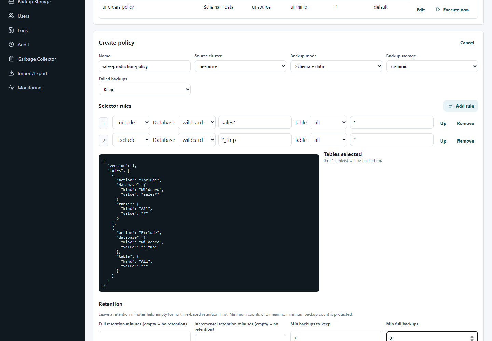
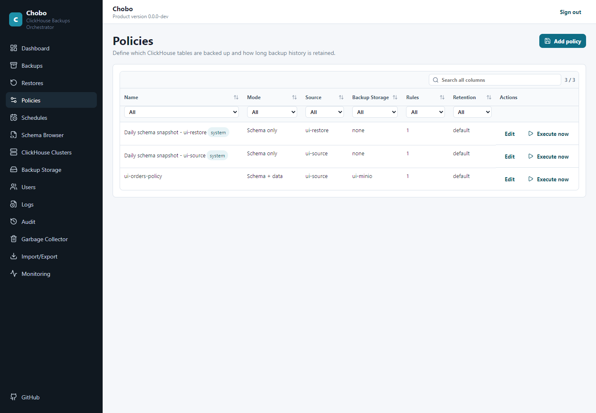
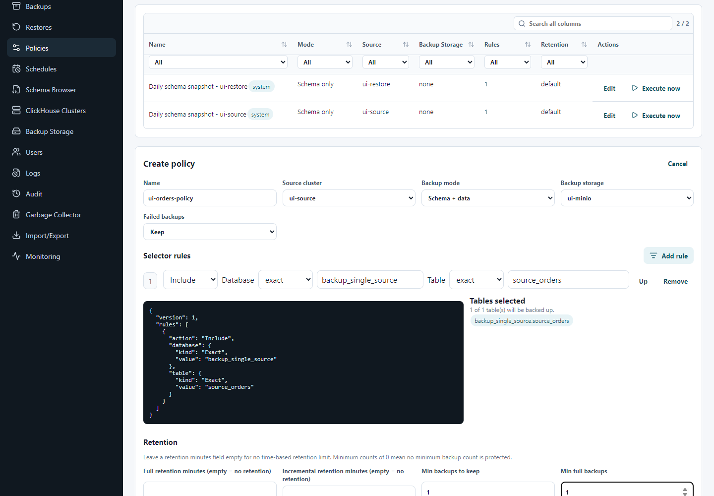
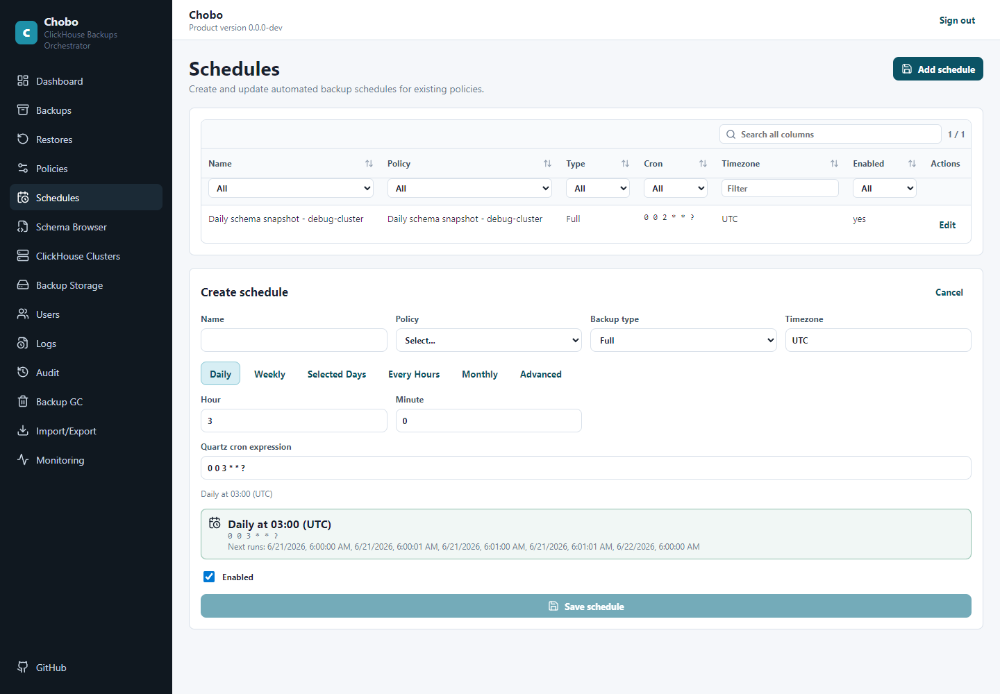

# Policies And Scheduling

Policies describe what Chobo should back up. Schedules describe when Chobo should run a policy.

## What A Policy Contains

A backup policy contains the source ClickHouse cluster, the S3-compatible backup target for schema+data backups, include and exclude rules, content mode, retention settings, and failed-backup cleanup behavior.

In the web GUI, open **Policies** and choose **Add policy**. The form keeps the important choices on one screen: name, source cluster, backup mode, backup storage, failed-backup behavior, selector rules, preview, and retention.



CLI example:

```powershell
ChoboCli policies add `
  --name sales-nightly `
  --source-cluster-id <cluster-id> `
  --target-id <target-id> `
  --selector-file .\sales-selector.json
```

Example output:

```json
{
  "id": "4e97f04c-b1ed-4766-9a3b-5162d02f0475",
  "name": "sales-nightly",
  "contentMode": "SchemaAndData",
  "failedBackupRetentionMode": "KeepAndExcludeFromMinBackupsToKeep"
}
```

After saving, the policy appears in the policy list with its mode, source, backup storage, rule count, retention summary, and actions.



## Table Selectors

Selectors are evaluated from top to bottom. A later exclude can remove a table that was included earlier, and a later include can add it back.

In the GUI, each selector row lets you choose the action, database match type, database value, table match type, and table value. The preview shows which ClickHouse tables match the current rules before you save.


```json
{
  "version": 1,
  "rules": [
    {
      "action": "include",
      "database": { "kind": "all", "value": "*" },
      "table": { "kind": "all", "value": "*" }
    },
    {
      "action": "exclude",
      "database": { "kind": "exact", "value": "system" },
      "table": { "kind": "all", "value": "*" }
    },
    {
      "action": "exclude",
      "database": { "kind": "wildcard", "value": "tmp_*" },
      "table": { "kind": "all", "value": "*" }
    }
  ]
}
```

Supported match kinds are `all`, `exact`, and `wildcard`. Chobo automatically excludes ClickHouse `system`, `information_schema`, and `INFORMATION_SCHEMA` from backup inventory.

Evaluate a selector before relying on it:

```powershell
ChoboCli policies evaluate --id <policy-id> --inventory-file .\inventory.json
```

Example inventory file:

```json
{
  "tables": [
    { "database": "sales", "table": "orders" },
    { "database": "sales", "table": "line_items" },
    { "database": "tmp_load", "table": "stage_orders" },
    { "database": "system", "table": "query_log" }
  ]
}
```

## Schema-Only Policies

Schema-only policies capture DDL without data. They are useful for change review and emergency reference, but they are not a replacement for data backups.

```powershell
ChoboCli policies add `
  --name daily-schema `
  --source-cluster-id <cluster-id> `
  --schema-only
```

Schema-only policies do not require `--target-id`, do not write S3 objects, and do not support incremental backups.

When a cluster is created, Chobo creates a reserved daily UTC schema-only policy and schedule for that cluster.

## Retention Settings

Retention is optional, but production policies should normally set it.

```powershell
ChoboCli policies update `
  --id <policy-id> `
  --name sales-nightly `
  --source-cluster-id <cluster-id> `
  --target-id <target-id> `
  --selector-file .\sales-selector.json `
  --full-retention-minutes 43200 `
  --incremental-retention-minutes 10080 `
  --min-backups-to-keep 7 `
  --min-full-backups-to-keep 2
```

See [Backup lifecycle management](BackupLifecycle.md) for deletion behavior.

## Failed Backup Cleanup

By default, failed and partially succeeded backups are kept for diagnostics:

```text
KeepAndExcludeFromMinBackupsToKeep
```

To let Chobo clean failed or partially succeeded backup objects after failure:

```powershell
ChoboCli policies update `
  --id <policy-id> `
  --name sales-nightly `
  --source-cluster-id <cluster-id> `
  --target-id <target-id> `
  --selector-file .\sales-selector.json `
  --failed-backup-retention-mode DeleteByGarbageCollectorAfterFailure
```

Use automatic failed-backup cleanup only when your team has enough logs and audits retained to investigate failures after objects are removed.

## Schedules

Schedules use Quartz-style cron expressions. Open **Schedules** in the web GUI or use the CLI.



Nightly full backup at 02:00 UTC:

```powershell
ChoboCli schedules add `
  --name sales-nightly-0200 `
  --policy-id <policy-id> `
  --backup-type Full `
  --cron "0 0 2 * * ?" `
  --timezone UTC `
  --missed-run-grace-period 00:05:00
```

Every six hours:

```powershell
ChoboCli schedules add `
  --name sales-every-six-hours `
  --policy-id <policy-id> `
  --backup-type Full `
  --cron "0 0 */6 * * ?" `
  --timezone UTC
```

Manage schedules:

```powershell
ChoboCli schedules list
ChoboCli schedules disable --id <schedule-id>
ChoboCli schedules enable --id <schedule-id>
ChoboCli schedules update --id <schedule-id> --name sales-nightly-0230 --policy-id <policy-id> --backup-type Full --cron "0 30 2 * * ?" --timezone UTC
ChoboCli schedules remove --id <schedule-id>
```

Check the dashboard after creating or changing schedules:

```powershell
ChoboCli dashboard --next-hours 24
```

Example output excerpt:

```json
{
  "schedules": [
    {
      "name": "sales-nightly-0200",
      "enabled": true,
      "lastRunStatus": "Succeeded",
      "lastSuccessfulCompletionUtc": "2026-06-21T02:04:18Z"
    }
  ],
  "upcomingRuns": [
    {
      "scheduleName": "sales-nightly-0200",
      "dueUtc": "2026-06-22T02:00:00Z",
      "backupType": "Full"
    }
  ]
}
```


## Incremental Backup Guidance

Incremental backups use existing full bases for the selected table shards. They can reduce backup time and storage use, but they make retention planning more important because one incremental can depend on multiple full backup runs.

Use incrementals when:

- a successful full backup already exists for the selected data;
- your restore runbook accounts for full-plus-incremental chains;
- retention keeps enough full bases for the incrementals you retain;
- operators know to check **Related full backups** before deleting base backups.

If an incremental finds a selected table or shard with no full base, Chobo backs up that table or shard as full inside the incremental run. Later incrementals can use that fallback full table or shard as their base.

Avoid incrementals for the first rollout, small datasets, or environments where a simple recurring full backup meets the recovery point objective.

## Manual Runs

Use a manual run after creating a policy and before depending on the schedule.

```powershell
ChoboCli backup manual --policy-id <policy-id> --backup-type Full
ChoboCli backups wait --id <backup-id> --timeout-seconds 1800 --poll-seconds 5
ChoboCli backups show --id <backup-id>
```

You can also run a one-off backup without a saved policy:

```powershell
ChoboCli backup manual `
  --cluster-id <cluster-id> `
  --target-id <target-id> `
  --selector-file .\sales-selector.json
```
