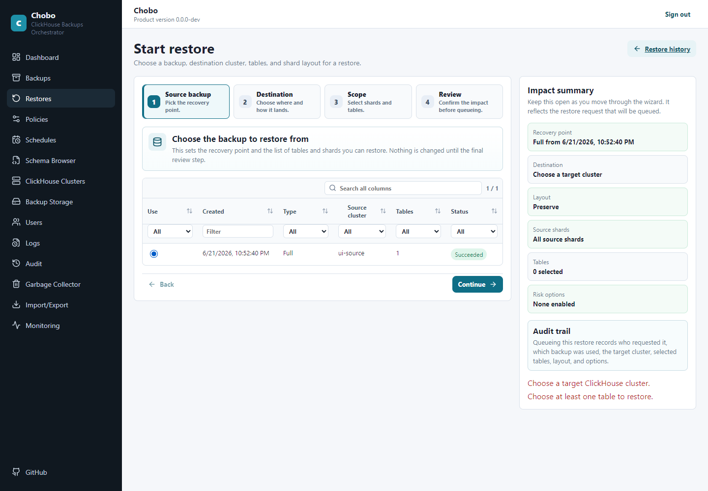
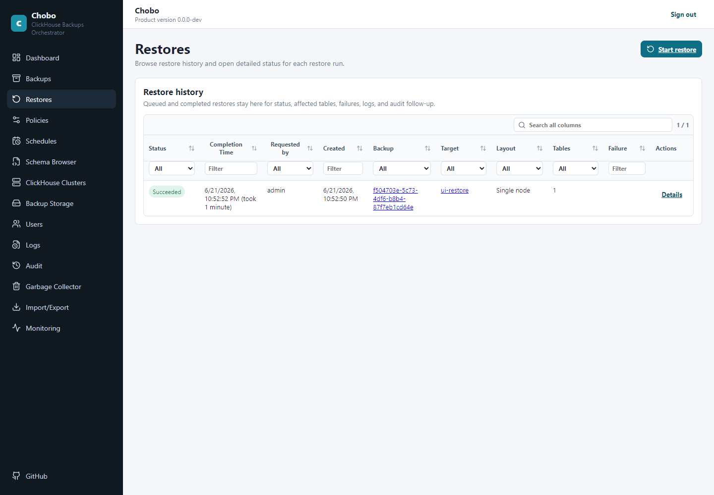
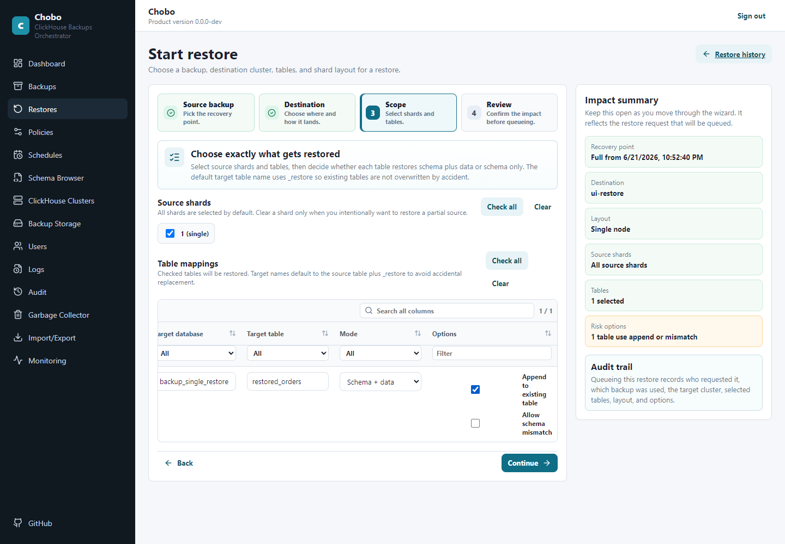
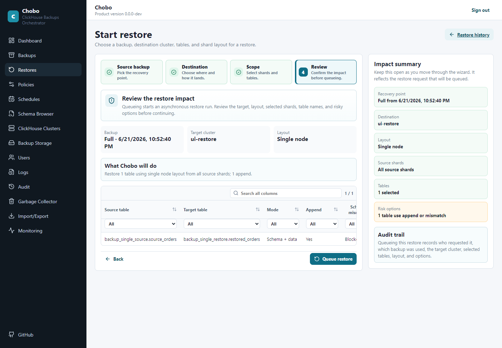
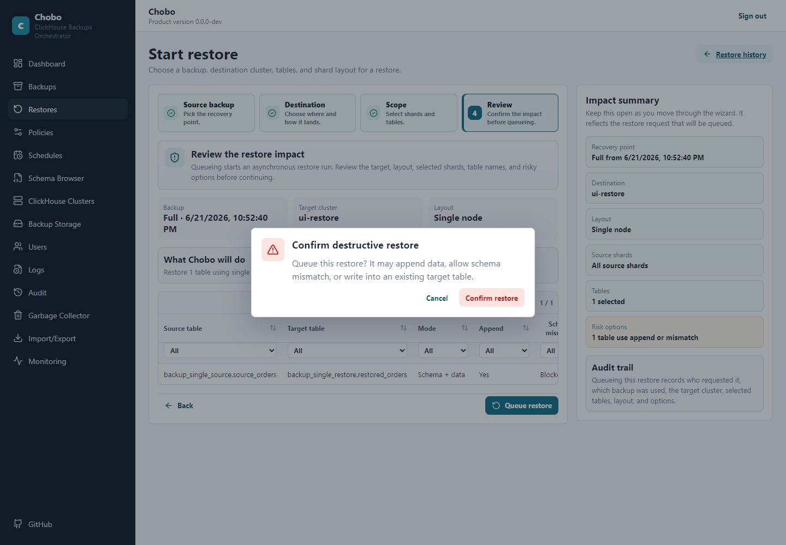
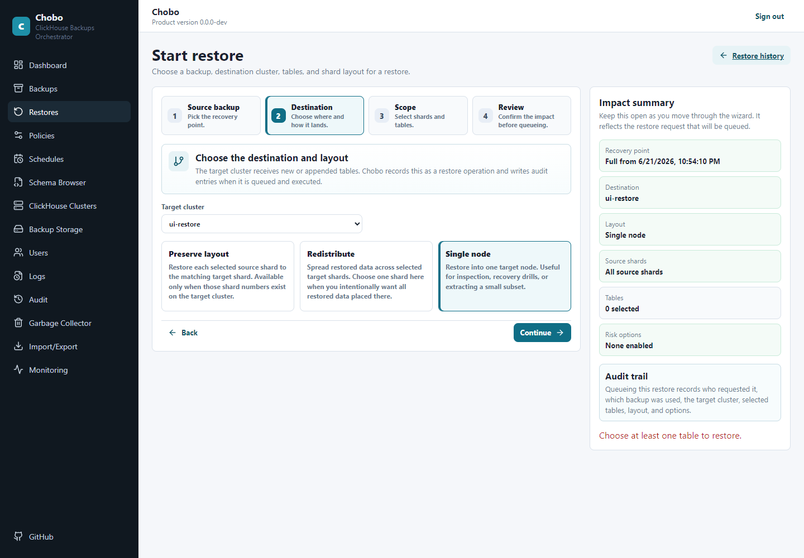
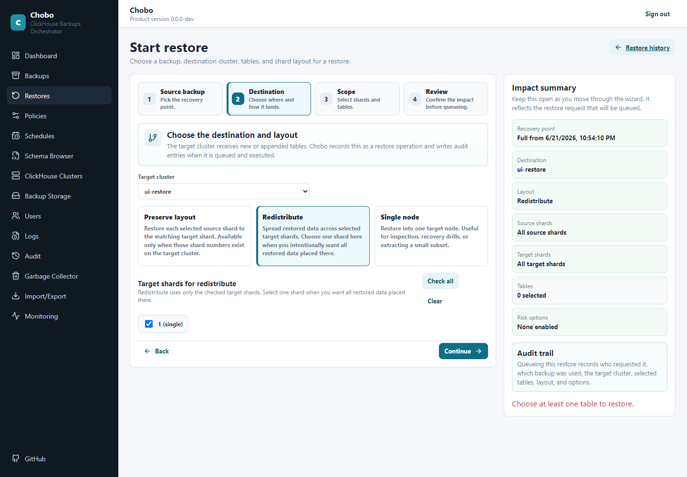

# Restores

Restore operations are created from an existing backup and a target ClickHouse cluster. Chobo queues the restore, runs ClickHouse async restore operations, and records run, table, and shard-level status.

Restores usually happen under pressure. Chobo is designed to make the choices explicit: which backup, which target cluster, which tables, whether to append or create, and how source shards map to target shards.

## Restore In The Web GUI

Open **Restores**, choose **Start restore**, and begin by selecting a successful backup. The first screen is intentionally read-only: it helps you choose the recovery point before any target system is touched.



After you choose the backup, the wizard keeps an impact summary visible while you move through destination, layout, table mapping, and review. The same choices are also available from the CLI for runbooks and automation.

## Emergency Restore Runbook

Use this path when you are restoring under pressure and need the lowest-risk sequence.

1. Identify the candidate backup.

```powershell
ChoboCli backups list --cluster-name prod-cluster --table-name sales.orders
ChoboCli backups show --id <backup-id>
```

Confirm the backup is `Succeeded` or `PartiallySucceeded`. For a partial backup, read the table and shard list before continuing.

2. Inspect the captured schema.

```powershell
ChoboCli schema show --backup-id <backup-id> --database sales --table orders
```

3. Prefer a scratch restore first.

```powershell
ChoboCli restore initiate `
  --backup-id <backup-id> `
  --target-cluster-id <target-cluster-id> `
  --database sales `
  --table orders `
  --target-database restore_validation `
  --target-table orders_from_backup
```

4. Wait and inspect details.

```powershell
ChoboCli restores wait --id <restore-id> --timeout-seconds 3600 --poll-seconds 5
ChoboCli restores show --id <restore-id>
```

5. Validate in ClickHouse before touching production names. Check row counts, important partitions, recent timestamps, and a few known records.

```sql
SELECT count() FROM restore_validation.orders_from_backup;
SELECT min(created_at), max(created_at) FROM restore_validation.orders_from_backup;
SELECT * FROM restore_validation.orders_from_backup WHERE order_id IN (1001, 1002, 1003);
```

6. Decide how to move forward.

- Keep the scratch table if analysts only need emergency read access.
- Rename or copy data using your normal ClickHouse change process if it must replace production data.
- Use `--append --confirm-destructive` only when the target table exists and appending is the intended recovery action.
- Stop and escalate if the backup is partial and the missing shard contains data you need.

7. Save the evidence. Capture the restore id, backup id, validation queries, and audit records in the incident ticket.

```powershell
ChoboCli audit show --last 200
ChoboCli logs show --last 500
```

## Restore Requirements

A backup can be restored only when its status is:

- `Succeeded`
- `PartiallySucceeded`

Deleted and delete-pending backups cannot be restored.

The target cluster must be configured in Chobo:

```powershell
ChoboCli clusters list
```

If the original backup is sharded, Chobo restores only source shards that completed successfully.

## Basic Restore

Restore all tables into the same database and table names on the target cluster:

```powershell
ChoboCli restore initiate --backup-id <backup-id> --target-cluster-id <cluster-id>
```

Wait for completion:

```powershell
ChoboCli restores wait --id <restore-id> --timeout-seconds 300 --poll-seconds 2
```

Inspect details:

```powershell
ChoboCli restores show --id <restore-id>
ChoboCli restores list
```

## Advanced ClickHouse Restore Settings

Restore settings are evaluated when the restore is started, using the current target cluster and current policy defaults. They are not stored in backup metadata.

Chobo merges settings in this order: target cluster restore defaults, the backup policy's default restore settings if the backup has a policy, then the manual restore values. In the GUI, the restore review step shows the inherited settings and lets you edit or remove them before launch.

CLI examples:

```powershell
ChoboCli clusters update --id <target-cluster-id> --clickhouse-restore-setting restore_threads=4
ChoboCli policies update --id <policy-id> --clickhouse-restore-setting max_backup_bandwidth=104857600
ChoboCli restore initiate --backup-id <backup-id> --target-cluster-id <cluster-id> --clickhouse-restore-setting restore_threads=2 --remove-clickhouse-restore-setting max_backup_bandwidth
```

Use ClickHouse `RESTORE ... SETTINGS` names and scalar JSON values only. See the ClickHouse backup/restore settings reference: <https://clickhouse.com/docs/operations/backup/overview#settings>. Chobo-owned settings, including `allow_non_empty_tables`, cannot be overridden.
In the GUI, restore history shows the current status. A successful run appears as a normal completed operation, not an error state.



Open the restore details page to see the restored tables, target names, and terminal status.


## Restore One Table

```powershell
ChoboCli restore initiate --backup-id <backup-id> --target-cluster-id <cluster-id> --database sales --table orders
```

Restore one table to a new name:

```powershell
ChoboCli restore initiate --backup-id <backup-id> --target-cluster-id <cluster-id> --database sales --table orders --target-database restore_sales --target-table orders_copy
```

Target database/table overrides are supported only when restoring a single table.

## Append Restore

The GUI table-mapping step shows which source table will restore into which target database and table. It also shows risky table options such as append and schema mismatch.



Append into an existing compatible table:

```powershell
ChoboCli restore initiate --backup-id <backup-id> --target-cluster-id <cluster-id> --database sales --table orders --append --confirm-destructive
```

Append requires the target table to already exist.

By default, Chobo rejects a target table with a different schema. To append common columns despite schema differences:

```powershell
ChoboCli restore initiate --backup-id <backup-id> --target-cluster-id <cluster-id> --database sales --table orders --append --confirm-destructive --allow-schema-mismatch
```

When schema mismatch is allowed, Chobo inserts only columns that exist in both the backup schema and the target table. The restore record includes a warning. `--confirm-destructive` is an explicit acknowledgement that you understand the append or schema-mismatch risk; it is not an overwrite option.

Before queueing a risky restore, the GUI shows a review page and then an explicit confirmation dialog.





## Restore Layouts

Use `--layout` to control source-shard to target-shard mapping.

In the GUI, layout is selected in the destination step. The cards explain the meaning before you continue.



`preserve` is the default:

```powershell
ChoboCli restore initiate --backup-id <backup-id> --target-cluster-id <cluster-id> --layout preserve
```

Preserve maps source shard N to target shard N. It requires matching source and target shard counts.

`redistribute` maps selected source shards across target shards in target shard order:

```powershell
ChoboCli restore initiate --backup-id <backup-id> --target-cluster-id <cluster-id> --layout redistribute
```

Use this when restoring from one shard count to another.

When **Redistribute** is selected, the wizard shows target shard selection so you can decide where restored data should land.



`single-node` restores selected source shards through the first target node:

```powershell
ChoboCli restore initiate --backup-id <backup-id> --target-cluster-id <cluster-id> --layout single-node
```

Use this for sharded-to-standalone restore or single-shard extraction.

## Source And Target Shard Controls

Restore only one source shard:

```powershell
ChoboCli restore initiate --backup-id <backup-id> --target-cluster-id <cluster-id> --layout single-node --source-shard 1
```

Force selected source shards into a target shard:

```powershell
ChoboCli restore initiate --backup-id <backup-id> --target-cluster-id <cluster-id> --layout preserve --target-shard 2
```

Shard numbers must be positive. If `--target-shard` is provided, Chobo verifies that the target shard exists.

## Existing Target Tables

Without `--append`, Chobo fails when the target table already exists.

With `--append`, Chobo fails when the target table does not exist.

For schema-only backup tables, Chobo creates the target table from the stored schema when it does not exist and marks the restore table as `SCHEMA_ONLY`.

## Sharded Restore Mechanics

For sharded restores, Chobo:

- Plans one restore shard task for each succeeded backup shard selected by the request.
- Creates the target database if needed.
- Uses temporary restore tables when appending or when multiple source shards flow into one logical target table.
- Runs ClickHouse `RESTORE TABLE ... FROM S3(...) ASYNC`.
- Polls `system.backups` for operation status.
- Inserts from temporary tables into the final target table when needed.
- Drops temporary tables after successful insertion.

The restore result includes per-shard target host, target shard number, restore table name, layout role, ClickHouse operation id, status, warning, and error.

## Failure Handling

Run and table statuses can be `PartiallySucceeded`. This happens when at least one required shard succeeds and at least one fails.

Inspect:

```powershell
ChoboCli restores show --id <restore-id>
ChoboCli audit show --last 200
ChoboCli logs show --last 500
```

Useful audit actions include:

- `shard-failed`
- `table-partially-succeeded`
- restore-level `partially-succeeded`
- restore-level `failed`

Restore records also expose `failureReason`, and each table or shard can expose its own `error`.

## Recovering Backup Metadata From Storage

If the local SQLite database is deleted or corrupted while the data directory marker remains, Chobo starts with a fresh SQLite database. Stored credentials must be re-entered. Startup writes a warning log, and Chobo does not automatically scan storage.

Recovery flow:

```powershell
ChoboCli server auth --server-url http://localhost:8080 --access-token <fresh-init-token>
ChoboCli targets add-s3 --name recovery-s3 --endpoint https://s3.example.com --bucket chobo-backups --path-prefix prod --access-key <key> --secret-key <secret>
ChoboCli backups recover --target-id <new-target-id> --scan-root backups
ChoboCli clusters update-credentials --id <recovered-cluster-id> --username <clickhouse-user> --password <clickhouse-password>
```

To recover from one known backup path instead of scanning:

```powershell
ChoboCli backups recover --target-id <new-target-id> --backup-path backups/full/policy-.../db/table/.../<backup-id>
```

Recovery preserves manifest IDs and recreates missing backup targets, source clusters, policies, schedules, schema definitions, backup runs, tables, and shards. The recovered backup target receives the S3 credentials from the target used for scanning. ClickHouse credentials are not stored in manifests, so update recovered cluster credentials before testing connections or running new work against that cluster.

Failed backups are imported when their manifests still exist in storage. They are useful for diagnostics and lifecycle decisions, but normal restore initiation remains limited to succeeded or partially succeeded backups.


## Restore Planning Checklist

Before starting a restore, confirm these points:

- the backup status is `Succeeded` or `PartiallySucceeded`;
- the backup contains the database and table you need;
- the target cluster is the correct environment;
- you know whether the target table should be created or appended to;
- the restore layout matches the target topology;
- you have reviewed schema differences if using `--append` or `--allow-schema-mismatch`;
- you have enough free storage and ClickHouse capacity for the restore.

When in doubt, restore to a new database or table name first, validate the data, and only then move it into the production path using your normal ClickHouse process.

## Sample Restore Outputs

Start a restore into a new table name:

```powershell
ChoboCli restore initiate `
  --backup-id 6b63350a-7073-49a3-884e-f77ee7f58433 `
  --target-cluster-id 91d95893-2f5c-4392-8994-cac4c75fd1e0 `
  --database sales `
  --table orders `
  --target-database restore_sales `
  --target-table orders_20260621
```

Initial output:

```json
{
  "id": "596d6d4a-cd0b-4afd-92da-dcdca1f89150",
  "backupId": "6b63350a-7073-49a3-884e-f77ee7f58433",
  "targetClusterId": "91d95893-2f5c-4392-8994-cac4c75fd1e0",
  "status": "Queued",
  "createdAt": "2026-06-21T09:15:00Z"
}
```

Wait for completion:

```powershell
ChoboCli restores wait --id 596d6d4a-cd0b-4afd-92da-dcdca1f89150 --timeout-seconds 1800 --poll-seconds 5
```

Completed output includes table and shard results:

```json
{
  "id": "596d6d4a-cd0b-4afd-92da-dcdca1f89150",
  "status": "Succeeded",
  "startedAt": "2026-06-21T09:15:03Z",
  "endedAt": "2026-06-21T09:18:41Z",
  "tables": [
    {
      "sourceDatabase": "sales",
      "sourceTable": "orders",
      "targetDatabase": "restore_sales",
      "targetTable": "orders_20260621",
      "status": "Succeeded",
      "shards": [
        {
          "sourceShardNumber": 1,
          "targetShardNumber": 1,
          "targetHost": "restore-s1-r1.example.com",
          "targetPort": 8123,
          "targetUseTls": false,
          "status": "Succeeded"
        }
      ]
    }
  ]
}
```

For a partially successful restore, do not guess. Inspect the failed shard before retrying:

```powershell
ChoboCli restores show --id <restore-id>
ChoboCli logs show --last 500
ChoboCli audit show --last 200
```

## Restore Cancellation

You can cancel a queued or running restore:

```powershell
ChoboCli restores cancel --id <restore-id>
```

Cancel only when continuing would be worse than stopping, such as a wrong target cluster or wrong table mapping. If ClickHouse has already started async restore work, inspect the restore details and target tables afterward. You may need to drop temporary or scratch objects according to your normal ClickHouse procedure.
