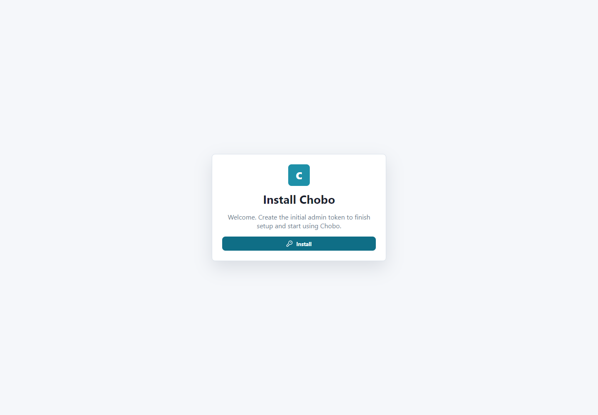

# Users And Access Control

Chobo uses users and bearer access tokens. The web GUI and CLI use the same API authentication.

## First Admin User

On first startup with an empty data directory, Chobo creates the first admin user through the web install screen.



Save the token when it is shown. Raw token values are not shown again.

Server-side bootstrap is also available through configuration:

```json
{
  "Chobo": {
    "Init": {
      "AdminUser": "admin",
      "AccessToken": "<initial-token>"
    }
  }
}
```

Environment aliases:

```text
CHOBO_INIT_ADMIN_USER
CHOBO_INIT_ACCESS_TOKEN
```

Use this only for controlled bootstrap. Prefer storing the initial token in a secret manager.

## Authenticate The CLI

Authenticate once:

```powershell
ChoboCli server auth --server-url https://chobo.example.com --access-token <token>
```

Or pass credentials per command:

```powershell
ChoboCli users list --server-url https://chobo.example.com --access-token <token>
```

The CLI checks `/api/v1/server/version` before normal commands. Keep the CLI version aligned with the server version.

## List Users

GUI: open **Users**.

CLI:

```powershell
ChoboCli users list
```

Example output:

```json
[
  {
    "id": "d1dc5a8a-5da1-40fa-b20d-56eac015513d",
    "username": "admin",
    "isActive": true,
    "createdAt": "2026-06-21T10:00:00Z"
  },
  {
    "id": "7e8d05e4-fdaf-44c6-97e4-cd4d6df3f709",
    "username": "backup-automation",
    "isActive": true,
    "createdAt": "2026-06-21T10:15:00Z"
  }
]
```

## Add A User

```powershell
ChoboCli users add --username restore-operator
```

Example output:

```json
{
  "user": {
    "id": "5f05af9e-b25c-479c-a083-992a28a3813c",
    "username": "restore-operator",
    "isActive": true
  },
  "accessToken": "chobo_4a3f..."
}
```

Store the token immediately.

## Manage Tokens

List token metadata:

```powershell
ChoboCli users tokens --id <user-id>
```

Create another named token:

```powershell
ChoboCli users add-token --id <user-id> --name monthly-restore-drill
```

Remove a token:

```powershell
ChoboCli users remove-token --id <user-id> --token-id <token-id>
```

Token lists contain metadata only. Chobo never prints old raw token values.

## Remove A User

```powershell
ChoboCli users remove --id <user-id>
```

This deactivates the user. Review audit records after user and token changes:

```powershell
ChoboCli audit show --last 100
```

## Recommended Token Practice

Use separate tokens for human DBA access, automation that checks dashboard or metrics, runbook automation that starts backups, and emergency restore operators.

Rotate tokens when people change roles or automation hosts are rebuilt. Do not reuse the first admin token for long-running automation.

## Permission Scope

Chobo users and active tokens currently have broad operator access to the Chobo API. Treat every token as capable of changing configuration, starting backups, starting restores, and viewing operational metadata.

Practical pattern:

- keep one or two break-glass admin tokens in a password manager;
- use separate automation tokens for scheduled checks or runbook jobs;
- create short-lived restore tokens for incident work when your process requires extra control;
- remove tokens immediately when they are no longer needed.